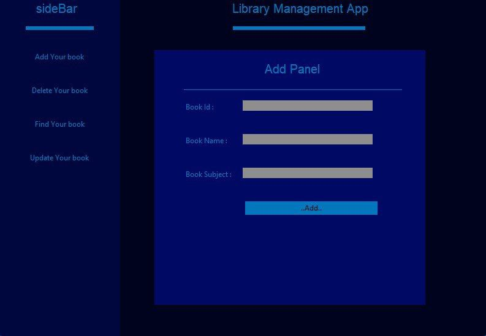
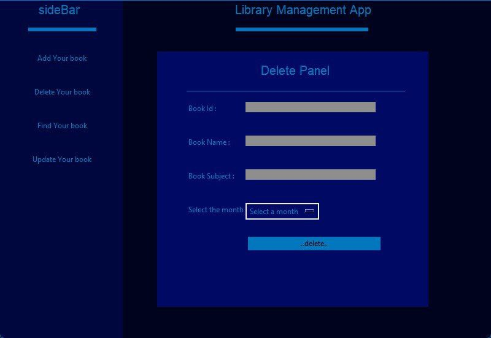
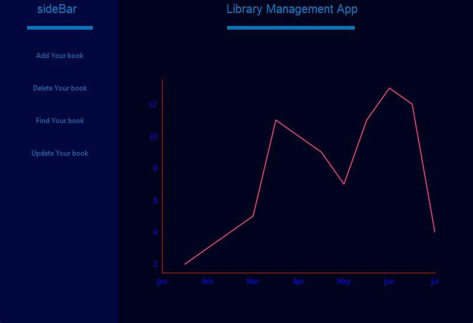
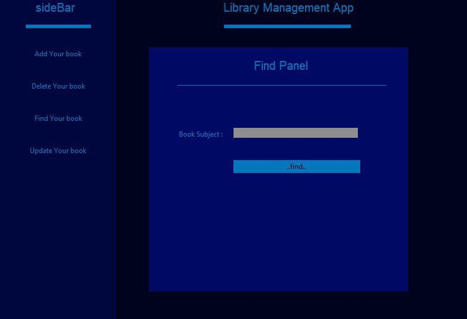

# Library Management System

A desktop-based Library Management System built with Python and Tkinter. The application provides an easy-to-use graphical interface for managing books, members, and borrowing records.

## Features

- Add, edit, and delete books
- Search books by title or author
- Issue and return books
- User-friendly Tkinter GUI
- Data persistence using SQLite

## Screenshots
### add screen

### delete screen

### chart screen

### search screen


## Tech Stack

- Python 3.x
- Tkinter
- matplotlib
- numpy
- SQLite3

## Installation

```bash
git clone https://github.com/mr-command/librarymanagementApp.git
cd librarymanagementApp
pip install -r requirements.txt
``` 

### Prerequisites

- Python 3.10 or higher

### Book Management

- Add new books to the library catalog.
- Update book information.
- Remove books from the system.
- Search for books instantly.
- manitor sold books

## Database

The application uses SQLite3 for local data storage.

## Author

Developed with Python and Tkinter and matplotlib.
